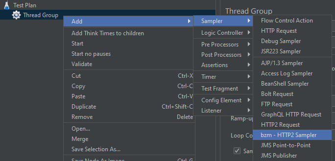
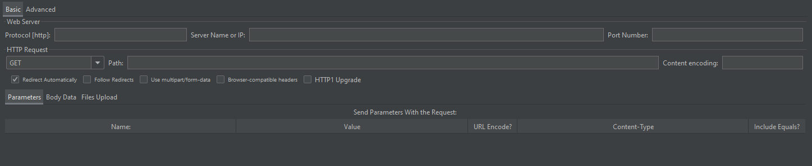
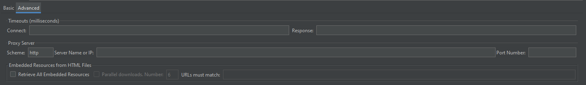

# HTTP2 Plugin for JMeter

---

This plugin provides an HTTP2 Sampler.

## To create your test:

1. Install the HTTP/2 plugin from the [plugins manager](https://www.blazemeter.com/blog/how-install-jmeter-plugins-manager).

2. Create a Thread Group.

3. Add the HTTP2 Sampler (Add-> Sampler-> bzm - HTTP2 Sampler).

After that you can add timers, assertions, listeners, etc.

## Configuring the HTTP2 Sampler:

Let's explain the HTTP2 Sampler fields:

### Basic tab:

| **Field**                  | **Description**                                                                                                                                                       | **Default** |
|----------------------------|-----------------------------------------------------------------------------------------------------------------------------------------------------------------------|-------------|
| Protocol                   | Choose  HTTP or HTTPS                                                                                                                                                 | HTTP        |
| Server name or IP          | The domain name or IP address of the web server.  *[Do not include the http:// prefix.]*.                                                        |             |
| Port number                | The port the web server is listening to                                                                                                                               | 80          |
| Method                     | GET, POST, PUT, PATCH, DELETE and OPTIONS are the ones supported at the moment.                                                                                       |             |
| Path                       | The path to resource (For example:  `/servlets/myServlet`).                                                                                                           |             |
| Content Encoding           | Content encoding to be used (for POST, PUT, PATCH and FILE).  This is the character encoding to be used, and is not related to the Content-Encoding HTTP header.      |             |
| Redirect Automatically     | Sets the underlying HTTP protocol handler to automatically follow redirects, so they are not seen by JMeter, and therefore will not appear as samples.                |             |
| Follow Redirects           | If set, the JMeter sampler will check if the response is a redirect and will follow it. The initial redirect and further responses will appear as additional samples. |             |
| Use multipart/form-data    | Use a `multipart/form-data` or `application/x-www-form-urlencoded` post request                                                                                       |             |
| HTTP1 Upgrade              | Enables the usage of the Upgrade header for HTTP1 request. (Not enabling this sets HTTP2 as default).       |             |

### Advanced tab: 

| **Field**                                       | **Description**                                                                                                                                                                                                                      | **Default** |
|-------------------------------------------------|--------------------------------------------------------------------------------------------------------------------------------------------------------------------------------------------------------------------------------------|-------------|
| **Timeouts (milliseconds):**                    |                                                                                                                                                                                                                                      |             |
| Connect                                         | Number of milliseconds to wait for a connection to open.                                                                                                                                                                             |             |
| Response                                        | The number of milliseconds to wait for a response.                                                                                                                                                                                   |             |
| **Proxy Server:**                               |                                                                                                                                                                                                                                      |             |
| Scheme                                          | The scheme identifies the protocol to be used to access the resource on the Internet.                                                                                                                                                | http        |
| Server name or IP                               | Hostname or IP address of a proxy server to perform request.  *[Do not include the http:// prefix]*.                                                                                                                                 |             |
| Port Number                                     | Port the proxy server is listening to.                                                                                                                                                                                               |             |
| Retrieve All Embedded Resources                 | Allows JMeter to parse the HTML file and send HTTP/HTTPS requests for all images, Java applets, JavaScript files, CSSs, etc. referenced in the file.                                                                                 |             |
| Parallel downloads                              | This feature allows the settings of a concurrent connection pool for retrieving embedded resources as part of the HTTP sampler.                                                                                                      |             |
| URLs must match                                 | Enables to filter the download of embedded resources that don't match the **regular expression**  set on it. For example, setting this regex `http:\/\/example\.invalid\/.*`, will only download the embedded resources that comes from `http://example.invalid/`.                              |             |

## Auth Manager
Currently, we only give support to the Basic and Digest authentication mechanism.
To make use of Basic preemptive authentication results, make sure to create and set the property `httpJettyClient.auth.preemptive`
to true in the jmeter.properties file.

