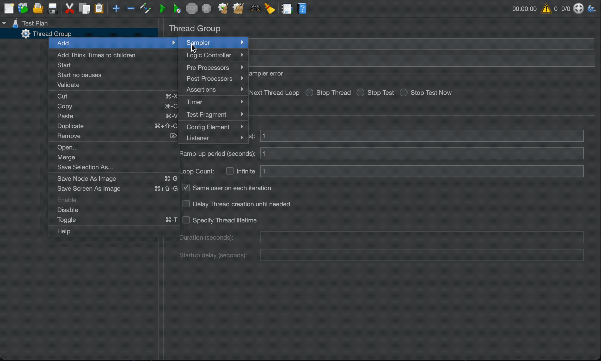

# HTTP2 Plugin for JMeter

---
<picture>
 <source media="(prefers-color-scheme: dark)" srcset="https://raw.githubusercontent.com/Blazemeter/jmeter-bzm-commons/refs/heads/master/src/main/resources/dark-theme/blazemeter-by-perforce-logo.png">
 
</picture>

This plugin provides an HTTP2 Sampler and a HTTP2 Controller in order to test you HTTP/2 endpoint.

_**IMPORTANT:** Java 11 required_

## To create your test:

1. Install the HTTP/2 plugin from the [plugins manager](https://www.blazemeter.com/blog/how-install-jmeter-plugins-manager).

2. Create a Thread Group.

3. Add the HTTP2 Sampler (Add-> Sampler-> bzm - HTTP2 Sampler).

After that you can add timers, assertions, listeners, etc.

## Configuring the HTTP2 Sampler:

Let's explain the HTTP2 Sampler fields:

### Basic tab:

| **Field**                  | **Description**                                                                                                                                                       | **Default** |
|----------------------------|-----------------------------------------------------------------------------------------------------------------------------------------------------------------------|-------------|
| Protocol                   | Choose  HTTP or HTTPS                                                                                                                                                 | HTTP        |
| Server name or IP          | The domain name or IP address of the web server.  *[Do not include the http:// prefix.]*.                                                        |             |
| Port number                | The port the web server is listening to                                                                                                                               | 80          |
| Method                     | GET, POST, PUT, PATCH, DELETE and OPTIONS are the ones supported at the moment.                                                                                       |             |
| Path                       | The path to resource (For example:  `/servlets/myServlet`).                                                                                                           |             |
| Content Encoding           | Content encoding to be used (for POST, PUT, PATCH and FILE).  This is the character encoding to be used, and is not related to the Content-Encoding HTTP header.      |             |
| Redirect Automatically     | Sets the underlying HTTP protocol handler to automatically follow redirects, so they are not seen by JMeter, and therefore will not appear as samples.                |             |
| Follow Redirects           | If set, the JMeter sampler will check if the response is a redirect and will follow it. The initial redirect and further responses will appear as additional samples. |             |
| Use multipart/form-data    | Use a `multipart/form-data` or `application/x-www-form-urlencoded` post request                                                                                       |             |
| HTTP1 Upgrade              | Enables the usage of the Upgrade header for HTTP1 request. (Not enabling this sets HTTP2 as default).       |             |

### Advanced tab:

| **Field**                                       | **Description**                                                                                                                                                                                                                      | **Default** |
|-------------------------------------------------|--------------------------------------------------------------------------------------------------------------------------------------------------------------------------------------------------------------------------------------|-------------|
| **Timeouts (milliseconds):**                    |                                                                                                                                                                                                                                      |             |
| Connect                                         | Number of milliseconds to wait for a connection to open.                                                                                                                                                                             |             |
| Response                                        | The number of milliseconds to wait for a response.                                                                                                                                                                                   |             |
| **Proxy Server:**                               |                                                                                                                                                                                                                                      |             |
| Scheme                                          | The scheme identifies the protocol to be used to access the resource on the Internet.                                                                                                                                                | http        |
| Server name or IP                               | Hostname or IP address of a proxy server to perform request.  *[Do not include the http:// prefix]*.                                                                                                                                 |             |
| Port Number                                     | Port the proxy server is listening to.                                                                                                                                                                                               |             |
| Retrieve All Embedded Resources                 | Allows JMeter to parse the HTML file and send HTTP/HTTPS requests for all images, Java applets, JavaScript files, CSSs, etc. referenced in the file.                                                                                 |             |
| Parallel downloads                              | This feature allows the settings of a concurrent connection pool for retrieving embedded resources as part of the HTTP sampler.                                                                                                      |             |
| URLs must match                                 | Enables to filter the download of embedded resources that don't match the **regular expression**  set on it. For example, setting this regex `http:\/\/example\.invalid\/.*`, will only download the embedded resources that comes from `http://example.invalid/`.                              |             |

## HTTP/1 Upgrade
When HTTP/1 Upgrade is selected means that the first request made by the plugin will contain all required headers for http1 upgrade.

However, there is a known issue which will send the upgrade when receiving an HTTP1 response even thought the option of HTTP1 Upgrade is not selected.
Additionally after the first request which may contain upgrade headers or not (depending on user selection) afterwards all HTTP/1.1 requests made as long as the server responds in HTTP/1.1 will contain upgrade headers.

## Buffer capacity
By default, the size of the downloaded resources is set to 2 MB (2097152 bytes) but, the limit can be increased by adding the `httpJettyClient.maxBufferSize` property on the jmeter.properties file in bytes.

## Multiplexing
One of the main features that were incorporated in HTTP2 was the multiplexing capability.
Multiplexing in HTTP2 allows for multiple concurrent requests and responses to be transmitted over a single connection, improving efficiency and reducing latency.

Currently, the plugin does not handle any limit for the asynchronous requests. However, it could be limited by setting the `maxConcurrentAsyncInController` property or it's also possible to tune the maximum number of requests per connection  
`httpJettyClient.maxRequestsPerConnection` which is 100 by default.

> IMPORTANT: All HTTP2 requests outside a HTTP2 Async Controller will run synchronous (multiplexing disabled)

## HTTP2 Async Controller

All HTTP2 samplers embedded in a HTTP2 Async controller will run asynchronous.

**Considerations**:
1. The amount of asynchronous requests will be determined by the JMeter property `httpJettyClient.maxConcurrentAsyncInController` which by default is `1000`

1. If there are any elements within the Async Controller that are not HTTP2Samplers, they will function as a synchronization point for all asynchronous requests that occur before those elements. This means that before executing the different element, the controller will wait for all previous requests to complete.

1. Listeners such as View Result Tree will process the elements that finish first, so the order in which they display results may not necessarily follow the TestPlan order.

## ALPN

The HTTP2 plugin offers Application-Layer Protocol Negotiation (ALPN) support, which facilitates the negotiation of application-layer protocols within the TLS handshake. This enables smooth communication between the client and server by allowing them to agree upon the protocols to be used.

The plugin supports the following protocols for ALPN negotiation:

- HTTP/1.1
- HTTP/2 (over TLS)
- HTTP/2 (over cleartext, h2c)

For TLS/SSL configuration please refer to [SSL Manager](https://jmeter.apache.org/usermanual/component_reference.html#SSL_Manager) and [Keystore Configuration](https://jmeter.apache.org/usermanual/component_reference.html#Keystore_Configuration)

## Auth Manager
Currently, we only give support to the Basic and Digest authentication mechanism.
To make use of Basic preemptive authentication results, make sure to create and set the property `httpJettyClient.auth.preemptive`
to true in the jmeter.properties file.

## Embedded Resources

To retrieve all embedded resources asynchronously, you simply need to choose "Parallel Downloads" as the option, unless the value is equal to 1.
If you would like to download embedded resources in a synchronous way choose "Parallel Downloads" and set the number to 1.

## Properties
This document describes JMeter properties. The properties present in jmeter.properties also should be set in the user.properties file. These properties are only taken into account after restarting JMeter as they are usually resolved when the class is loaded.

| **Attribute**                                       | **Description**                                                                  | **Default** |
|-----------------------------------------------------|----------------------------------------------------------------------------------|-------------|
| **httpJettyClient.maxBufferSize**                   | Maximum size of the downloaded resources in bytes                                | 2097152     |
| **httpJettyClient.minThreads**                      | Minimum number of threads per http client                                        | 1           |
| **httpJettyClient.maxThreads**                      | Maximum number of threads per http client                                        | 5           |
| **httpJettyClient.maxRequestsQueuedPerDestination** | Maximum number of requests that may be queued to a destination                   | 32767       |
| **httpJettyClient.maxConnectionsPerDestination**    | Sets the max number of connections to open to each destinations                  | 1           |
| **httpJettyClient.byteBufferPoolFactor**            | Factor number used in the allocation of memory in the buffer of http client      | 4           |
| **httpJettyClient.strictEventOrdering**             | Force request events ordering                                                    | false       |
| **httpJettyClient.removeIdleDestinations**          | Whether destinations that have no connections should be removed                  | true        |
| **httpJettyClient.idleTimeout**                     | the max time, in milliseconds, a connection can be idle                          | 30000       |
| **httpJettyClient.auth.preemptive**                 | Use of Basic preemptive authentication results                                   | false       |
| **httpJettyClient.maxConcurrentPushedStreams**      | Sets the maximum number of server push streams that is allowed to concurrently receive from a server | 100 |
| **httpJettyClient.maxConcurrentAsyncInController**  | Maximum number of concurrent http2 samplers inside a HTTP2 Async Controller      | 1000        |
| **HTTPSampler.response_timeout**                    | Maximum waiting time of request without timeout defined, in milliseconds         | 0           |
| **http.post_add_content_type_if_missing**           | Add to POST a Header Content-type: application/x-www-form-urlencoded if missing? | false       | 
