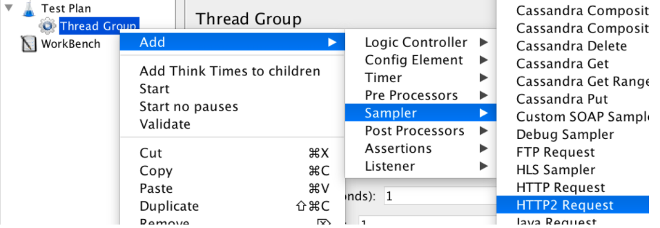
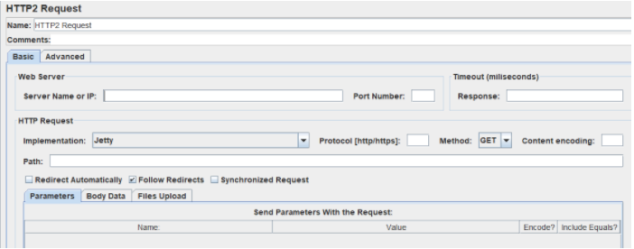
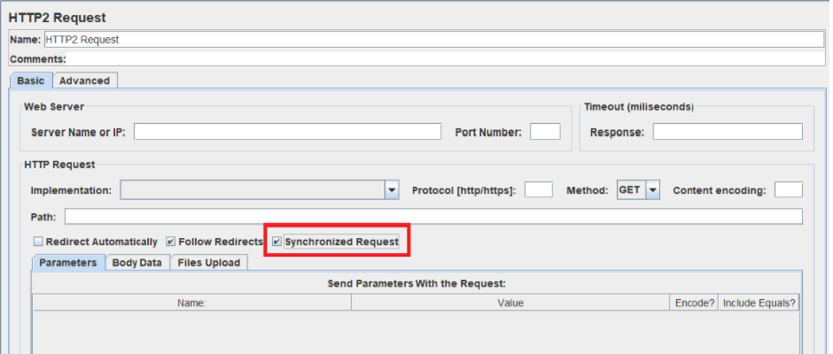

# HTTP2 Plugin for JMeter

This plugin provides an HTTP2 Sampler and a custom View Result Tree to work with HTTP/2 protocol.

---
### *This plugin is deprecated and there will be no further support for it. Consider migrating to the [lastest version](https://github.com/Blazemeter/jmeter-http2-plugin/tree/HTTP2_V2.0) of the plugin.*

By migrating you will notice not only major improvements on performance but also the improved functionalities over this legacy version, like SSL, Auth, Cookie and Cache Manager support, improved redirect functionality and better error handling among others.

> Please note that you need to install OpenJDK version 11 as older versions won't work.
---

### Step to use HTTP2 Sampler

As Java 8 does not have native support for HTTP/2, you will need to ensure you have alpn-boot on your system and edit `JVM_ARGS` as follows:

> Please note that you need to install OpenJDK version 8 as newer version won't work.

1- Download alpn-boot from [here](https://mvnrepository.com/artifact/org.mortbay.jetty.alpn/alpn-boot) according to your JVM version as stated in this [page](https://www.eclipse.org/jetty/documentation/jetty-9/index.html#alpn)
	
2- On Windows at the start of jmeter.bat add the next line:
		`set JVM_ARGS= -Xbootclasspath/p:<path.to.jar>;`

   On Linux and Mac at the start of jmeter.sh add the next line (see _Notes JMeter for macOS_ section at the bottom as well):
		`JVM_ARGS="-Xbootclasspath/p:<path.to.jar>"`

3- Restart JMeter

### To create your test:

1 - Create a Thread Group.

2 - Add the HTTP Sampler Add->Sampler->HTTP2 Sampler

3 - After that you can add timers, assertions, listeners, etc.

### Configuring the HTTP2 Sampler

Let’s explain the HTTP2 Sampler fields:

**Name** - Add a descriptive name for this HTTP/2 sampler to be shown in the tree.

**Server Name or IP** -   The domain name or IP address of the web server, e.g. www.sprint.com. [Do not include the http:// prefix.]

**Port Number** - The port the web server is listening to. Default: 443

**Response** - The number of milliseconds to wait for a response. Note that in this sampler we don’t include the field for the connection timeout since HTTP/2 has an automatic initial connection setting, and all samplers use this same connection. This is one of the cool features of HTTP/2. 

**Implementation** - Choose Jetty or Java. The default implementation is Jetty since it is the only one implemented at the moment. The Java implementation will be added in future release. 

**Protocol** - Choose   HTTP or HTTPS. Default: HTTPS

**Method** -  GET and POST are the ones supported at the moment.

**Content Encoding** - The content encoding to be used (for POST). This is the character encoding to be used, and is not related to the Content-Encoding HTTP header.

**Path** - The path to resource (For example: /servlets/myServlet)

**Redirect Automatically** - Sets the underlying HTTP protocol handler to automatically follow redirects, so they are not seen by JMeter, and therefore will not appear as samples. 

**Follow Redirects** -  If set, the JMeter sampler will check if the response is a redirect and will follow it. The initial redirect and further responses will appear as additional samples.

**Synchronized Request** - If set, JMeter will wait until receiving the response before sending more requests.
Send Parameters With the Request - All the fields are equivalent to HTTP/1.1 fields.

### Limitations

HTTP/2 is an asynchronous protocol, meaning we don’t have to wait for the response of the server to continue the communication. But the JMeter model executes synchronously. Therefore, if we want to add assertions or post processors to our HTTP/2 Requests, i. e. process the response, we need to select the checkbox Synchronized Request to indicate that JMeter needs to wait until receiving the response before sending more requests. On the other hand, not having synchronized requests enabled may be useful if we want to simulate the regular HTTP2 communication without waiting for a response every time we send a request. Apart from that, it is possible to execute post processor and assertions over asynchronous requests but there is no guarantee that it works in all cases as is wanted because the context of the execution could be different than the expected. So the only guaranteed assertions that will work as expected will be the ones that use the response data of the executed sampler. The actions to be taken after a Sampler error do not work with asynchronous request

### Notes JMeter for macOS

* You can install pre-built binary of OpenJDK 8 via https://github.com/AdoptOpenJDK/homebrew-openjdk by using brew to install, just follow along with 2 commands to execute as shown on its repository's README.
* You need to ensure that `$JAVA_HOME` is set to OpenJDK 8's path. You might have to edit your `~/.bash_profile` and set `JAVA_HOME=/you/openjdk/path` then source it again via `source ~/.bash_profile`.
