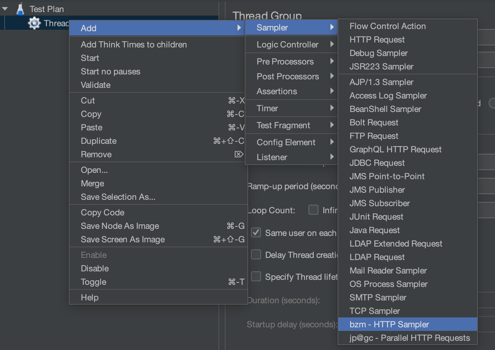
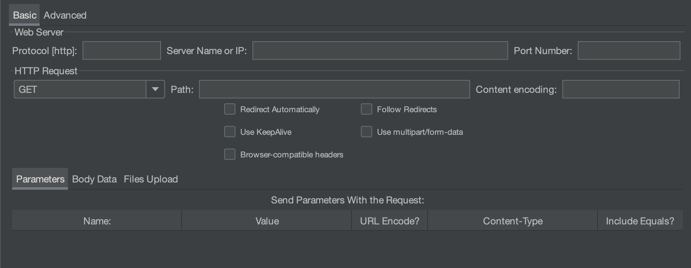
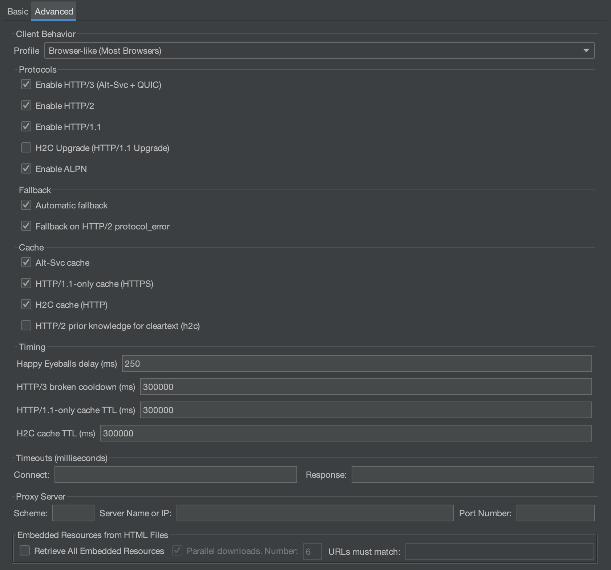
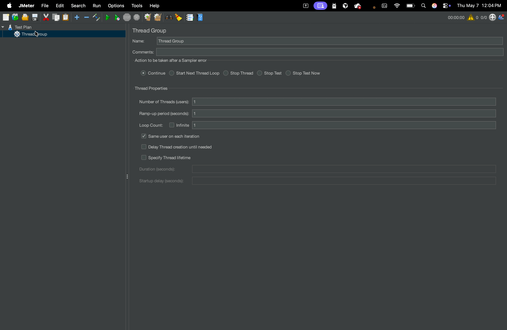

# BlazeMeter HTTP Plugin for JMeter (HTTP/1.1, HTTP/2, HTTP/3/QUIC)

---
<picture>
 <source media="(prefers-color-scheme: dark)" srcset="https://raw.githubusercontent.com/Blazemeter/jmeter-bzm-commons/refs/heads/master/src/main/resources/dark-theme/blazemeter-by-perforce-logo.png">
 
</picture>

This plugin provides a `bzm - HTTP Sampler` (multi-protocol: **HTTP/1.1**, **HTTP/2**, **HTTP/3 (QUIC)**) and **`bzm - HTTP Async Controller`** so multiple BlazeMeter HTTP samplers can run **overlapped in time** (concurrent sampler execution controlled by that controller—not the same thing as HTTP/2 stream multiplexing on the wire).

_**IMPORTANT:** Requires **Java 17+**._

_**Compatibility:** Use **Java** and **Apache JMeter** versions that are **supported together** for the JMeter release you run. Through **JMeter 5.6.3**, JMeter does **not** support **Java** versions **newer than 21** — use **Java 17** or **Java 21** with those JMeter lines unless your vendor documents otherwise. For newer JMeter versions, follow Apache’s prerequisites in **[Getting Started](https://jmeter.apache.org/usermanual/get-started.html)** and the release notes for that version._

# Setup

Install the plugin from the [JMeter Plugins Manager](https://www.blazemeter.com/blog/how-install-jmeter-plugins-manager).

## To create your test

### Option A: Recording (JMeter HTTP(S) Test Script Recorder)

This plugin can act as a sampler creator during JMeter proxy recording; it is **enabled by default**.

1. Use JMeter’s [**HTTP(S) Test Script Recorder**](https://jmeter.apache.org/usermanual/jmeter_proxy_step_by_step.html) as usual.

2. As the elements are recorded, the plugin creates the BlazeMeter HTTP Sampler automatically.

Notes:

- To disable recording support, use the Tools menu -> BlazeMeter HTTP -> Disable...
- You can also disable this manually by adding or updating `blazemeter.http.proxy_enabled=false` in `user.properties`.
- The recorder creates `bzm - HTTP Sampler` elements, but you may still want to adjust protocol/profile settings afterwards.

### Option B: Recording with BlazeMeter Automatic Correlation Recorder

This plugin is also compatible with the BlazeMeter Automatic Correlation Recorder recording method.

For more information: [BlazeMeter Automatic Correlation Recorder - Installing the Plugin](https://blazemeter.github.io/CorrelationRecorder/guide/installation-guide.html#prerequisites)

Notes:

- Since BlazeMeter Automatic Correlation Recorder inherits and is compatible with the JMeter recorder, the process of enabling and disabling Recording support is the same as the method documented in Option A.

### Option B: Manual setup

1. Create a Thread Group.

2. Add the HTTP Sampler (Add -> Sampler -> bzm - HTTP Sampler).

3. Configure the sampler URL + client behavior (profile/protocols) as described below.
4. Add timers, assertions, listeners, etc.

_**NOTE:** Where possible the sampler aligns with behaviors you know from JMeter’s **HTTP Request**. There are deliberate differences wherever multi-protocol negotiation, QUIC, or the Jetty client requires them._

## Configuring the sampler

The sampler UI has two tabs: **Basic** (URL + request basics) and **Advanced** (client behavior + timeouts/proxy/embedded resources).

### Basic tab

This is the standard JMeter URL configuration panel (domain, port, path, method, redirects, body, etc.).

| **Field** | **Description** | **Default** |
|---|---|---|
| Protocol | `http` or `https` (URL scheme). This is independent from HTTP/1.1 vs HTTP/2 vs HTTP/3 negotiation. | `http` |
| Server name or IP | Target host (no `http://` prefix). | |
| Port number | Target port. | `80` for http, `443` for https |
| Method | Standard HTTP methods supported by JMeter. | `GET` |
| Path | Path + query (e.g. `/api/v1/items?limit=10`). | `/` |
| Content encoding | Character encoding used for request body (unrelated to HTTP `Content-Encoding` header). | |
| Redirect Automatically / Follow Redirects | Same semantics as JMeter’s HTTP Request sampler. | |
| Use KeepAlive | Reuse connections when possible (same semantics as JMeter’s HTTP Request sampler). | |
| Browser-compatible headers | Add headers that mimic common browser behavior (same semantics as JMeter’s HTTP Request sampler). | |
| Use multipart/form-data | Same semantics as JMeter’s HTTP Request sampler. | |

### Advanced tab

#### Client Behavior -> Profile

A **profile** is a named bundle of protocol defaults (which protocols are enabled, whether ALPN is enabled, fallback/caches, and timings). Profiles make it easy to mimic “how browsers behave” vs “legacy compatibility”.

The available profiles are:

- **Browser-like (Most Browsers)** (`browser-like`) (default)
- **Browser-compatible (Other Browsers)** (`browser-compatible`)
- **Legacy / Older Systems** (`legacy`)
- **Browser-like (Custom)** (`browser-like-custom`) (persists per-sampler toggles below)

#### Client Behavior -> Protocols / Fallback / Cache / Timing

| **Control** | **What it does** |
|---|---|
| Enable HTTP/3 (Alt-Svc + QUIC) | Allows HTTP/3 when the origin advertises it via `Alt-Svc`. Typically requires `https` and UDP/QUIC reachability. |
| Enable HTTP/2 | Allows HTTP/2. Over TLS this is typically negotiated via ALPN. For cleartext origins see H2C options below. |
| Enable HTTP/1.1 | Allows HTTP/1.1. If disabled, the client will avoid HTTP/1.1 unless forced by server/proxy constraints. |
| H2C Upgrade (HTTP/1.1 Upgrade) | For cleartext (`http://`) origins, allow HTTP/1.1 -> HTTP/2 (h2c) upgrade. Visible when HTTP/1.1 and HTTP/2 are enabled. |
| Enable ALPN | Enables TLS ALPN for **HTTPS** (**HTTP/1.1** and **HTTP/2**). (**HTTP/3 discovery** uses **Alt-Svc**, not ALPN.) Cleartext **h2c** uses upgrade/prior-knowledge flows instead of TLS ALPN. |
| Automatic fallback | Enables automatic fallback between protocols (e.g. prefer HTTP/3, then fall back to HTTP/2/1.1 as needed). |
| Fallback on HTTP/2 protocol_error | If an HTTP/2 `protocol_error` occurs, retry using HTTP/1.1 (when fallback is enabled). |
| Alt-Svc cache | Caches `Alt-Svc` advertisements used for HTTP/3 discovery. |
| HTTP/1.1-only cache (HTTPS) | Caches “this HTTPS origin should be treated as HTTP/1.1-only” after failures, to avoid repeated negotiation overhead. |
| H2C cache (HTTP) | Caches h2c capability for cleartext origins. |
| HTTP/2 prior knowledge for cleartext (h2c) | Forces HTTP/2 prior knowledge (h2c) for cleartext origins, skipping the upgrade dance. Use only if you know the server speaks h2c. |
| Happy Eyeballs delay (ms) | When trying HTTP/3, delay before starting HTTP/2 in parallel (H3+H2) to reduce latency while avoiding extra connections. |
| HTTP/3 broken cooldown (ms) | How long to consider HTTP/3 “broken” for an origin after failures before retrying. |
| HTTP/1.1-only cache TTL (ms) | How long to keep the “HTTP/1.1-only” decision for an HTTPS origin. |
| H2C cache TTL (ms) | How long to keep the “h2c supported” decision for a cleartext origin. |

#### Timeouts (milliseconds)

| **Field** | **Description** |
|---|---|
| Connect | Milliseconds to wait for a connection to open. |
| Response | Milliseconds to wait for a response. |

#### Proxy Server

| **Field** | **Description** |
|---|---|
| Scheme | Proxy scheme (typically `http`). |
| Server name or IP | Proxy host. |
| Port Number | Proxy port. |

#### Embedded resources

| **Field** | **Description** |
|---|---|
| Retrieve All Embedded Resources | Parses HTML and downloads embedded resources (images, JS, CSS, etc.). |
| Parallel downloads | When enabled, embedded resources are fetched concurrently; “pool size = 1” forces synchronous behavior. |
| URLs must match | Regex filter for which embedded resources to download. |

## Protocols: how to use HTTP/1.1 vs HTTP/2 vs HTTP/3

The simplest way is to pick a profile and only override when you need a specific behavior.

Common configurations:

- **Prefer HTTP/3, fallback to HTTP/2/1.1**: profile `browser-like` (default). Ensure **Enable HTTP/3** and **Automatic fallback** are enabled.
- **HTTP/2-only (TLS)**: disable **Enable HTTP/1.1**, disable **Enable HTTP/3**, keep **Enable HTTP/2** enabled. (For `https://` origins, ALPN typically must be enabled.)
- **HTTP/1.1-only**: keep **Enable HTTP/1.1** enabled, disable HTTP/2 and HTTP/3.
- **Cleartext h2c (upgrade)**: use `http://` scheme, enable HTTP/1.1 + HTTP/2, and enable **H2C Upgrade**.
- **Cleartext h2c (prior knowledge)**: use `http://` scheme, enable HTTP/2, enable **HTTP/2 prior knowledge for cleartext (h2c)** (only if the server supports it).

HTTP/3 notes:

- HTTP/3 is **discovered via Alt-Svc** (and optionally cached), not via ALPN.

## Buffer capacity

By default, the size of downloaded resources is limited to 2 MB (2,097,152 bytes); you can raise the limit by setting `blazemeter.http.maxBufferSize` in `jmeter.properties` or `user.properties` (value in bytes).

## Multiplexing, HTTP/2, and overlapping sampler execution

**HTTP/2 multiplexing** means many requests can share **one TLS/TCP connection** as separate streams—the Jetty stack does this whenever negotiation selects HTTP/2.

**Overlapping sampler execution** (several BlazeMeter HTTP samplers in progress at once **within one thread iteration**) requires **`bzm - HTTP Async Controller`**. Its default in-flight ceiling (when **Limit max number of parallel executions** is off) follows **`blazemeter.http.maxConcurrentAsyncInController`** (default **100**); when limiting is enabled, **`blazemeter.http.controller.maxConcurrentAsyncInController`** is stored on the controller from the GUI. Tune **`blazemeter.http.maxRequestsPerConnection`** (default **100**) for Jetty concurrency per pooled connection.

> **IMPORTANT:** Outside **`bzm - HTTP Async Controller`**, a Thread Group still runs BlazeMeter HTTP samplers **one after another** (the sampler returns before JMeter proceeds). That sequential **test-plan** pacing is orthogonal to HTTP/2 **transport** multiplexing.

## HTTP Async Controller

Add **`bzm - HTTP Async Controller`** (**Add -> Logic Controller -> bzm - HTTP Async Controller**). The tree shows that label; recorder tooling (**Tools -> BlazeMeter HTTP**) uses the same name. BlazeMeter HTTP samplers that are **direct children** of this controller can execute **with overlap**, subject to caps and checkpoints below.

**Considerations**:

1. **Concurrency cap**: The JMeter property **`blazemeter.http.maxConcurrentAsyncInController`** sets the default ceiling (**100**) used when **Limit max number of parallel executions** is **unchecked**. When that limit is enabled in the UI, the cap is stored on the controller under **`blazemeter.http.controller.maxConcurrentAsyncInController`**.
2. Elements within the Async Controller that are not BlazeMeter HTTP samplers act as synchronization points for all asynchronous requests that occurred before them. Before those elements execute, the controller waits for all such requests to complete.
3. Listeners such as **View Results Tree** process whichever samples finish first, so the displayed order may not match the Test Plan order.
4. Parent sample (**Generate Parent Sample**): **`blazemeter.http.controller.generateParentSample`** persists the UI toggle; child BlazeMeter HTTP results attach as **sub-results** of that aggregated sample. Optionally set this key in **`user.properties`** / **`jmeter.properties`** as the default for **new** controllers when the `.jmx` has no explicit value.

## ALPN

The plugin uses **TLS ALPN** so HTTPS connections can advertise **HTTP/1.1** and **HTTP/2** (`h2`). **HTTP/3 discovery** is separate—it relies on **`Alt-Svc`** (see **Protocols** above), not TLS ALPN.

Cleartext **h2c** never uses TLS ALPN; negotiation uses **HTTP/1.1 Upgrade** or **prior knowledge**, matching the **`http://`** options described elsewhere in this README.

For TLS keystores/truststores, see JMeter’s [SSL Manager](https://jmeter.apache.org/usermanual/component_reference.html#SSL_Manager) and [Keystore Configuration](https://jmeter.apache.org/usermanual/component_reference.html#Keystore_Configuration).

## Auth Manager

Currently, we only support the Basic and Digest authentication mechanisms.

To use Basic preemptive authentication, set `blazemeter.http.auth.preemptive` to **`true`** in **`jmeter.properties`** or **`user.properties`**.

## Embedded Resources

To fetch embedded resources asynchronously, enable **Parallel downloads** unless the pool size equals **1** (which behaves synchronously).

To fetch them synchronously, enable **Parallel downloads** and set the pool size to **1**.

## Properties

Most names documented below are **JMeter properties**: place them in **`user.properties`** (preferred for overrides), **`jmeter.properties`**, or JMeter’s UI equivalents so they enter the merged **`JMeterUtils`** map.

Layout:

- **`blazemeter.http.*`** governs BlazeMeter HTTP client defaults—profiles, protocol toggles, pooling, QUIC, caches, auth, concurrency caps unrelated to persisted controller checkbox state, embedded resources knobs, etc.
- **`blazemeter.http.controller.*`** survives **inside each `bzm - HTTP Async Controller` element** in the `.jmx` whenever you toggle that controller’s options (see **HTTP Async Controller property names**, below).

**Construction-time globals** versus **serialized controller fields**:

| Source | Applies when |
|---|---|
| **`blazemeter.http.controller.generateParentSample`** in **`user.properties` / `jmeter.properties`** | **New controllers** lacking an explicit value on the `.jmx` inherit this boolean default. |
| **`blazemeter.http.maxConcurrentAsyncInController`** | Defines the concurrent ceiling whenever **Limit max number of parallel executions** is unchecked; flipping that checkbox persists **`blazemeter.http.controller.maxConcurrentAsyncInController`** instead. |
| **`blazemeter.http.controller.limitMaxParallel`** and **`blazemeter.http.controller.maxConcurrentAsyncInController` on `.jmx`** | Come from GUI saves/manual XML edits—they are **not** supplied automatically from unrelated JMeter properties. |

**Java system properties** (set on the launcher as **`-Dname=value`**). They are **not** loaded from **`user.properties`** / **`jmeter.properties`**.

| **Attribute** | **Description** | **Default** |
|---|---|---:|
| **blazemeter.http.lowLevelLog** | Enables low-level HTTP/2/3 client tracing (may write under **`target/`**, e.g. **`http2-debug.log`**) | false |
| **blazemeter.http.skipHttp2Settings** | Skips custom HTTP/2 SETTINGS tuning in the client | false |
| **blazemeter.http.directSend** | Uses Jetty **`request.send()`** directly (diagnostic; bypasses listener path) | false |
| **blazemeter.http.disableBrotliDecoder** | Disables Brotli content decoder registration | false |
| **blazemeter.http.disableZstdDecoder** | Disables Zstandard content decoder registration | false |
| **blazemeter.http.disableGzipDecoder** | Disables gzip content decoder registration | false |
| **blazemeter.http.disableDeflateDecoder** | Disables deflate content decoder registration | false |
| **blazemeter.http.skipManualDecodeWhenAdvertised** | Skips redundant manual body decode when **`Content-Encoding`** is already advertised | true |

**Recording UI tracing (JMeter property, not `-D`):** **`blazemeter.http.debugProxyRecorderTypeUi=true`** — normal **JMeter** property; **`jmeter.log`** lines use prefix **`[bzm proxy recorder Type UI]`** when enabled.

More context for the **`-D`** flags: **`docs/http2-jetty-debug-notes.md`**.

Restart JMeter after changing JMeter properties that are applied when affected classes initialize.

### Protocol Profiles

You can select a profile that controls default protocol behavior. Per-property overrides always take precedence over the profile defaults.

- **browser-like** (default)
- **browser-like-custom**
- **browser-compatible**
- **legacy**

Profile selection:

| **Attribute** | **Description** | **Default** |
|---|---|---|
| **blazemeter.http.profile** | Protocol behavior profile | browser-like |

Profile defaults summary:

| **Profile** | **HTTP/3** | **HTTP/2** | **HTTP/1.1** | **ALPN** | **Happy Eyeballs** |
|---|---:|---:|---:|---:|---:|
| browser-like | on | on | on | on | 250 ms |
| browser-like-custom | on | on | on | on | 250 ms |
| browser-compatible | on | on | on | on | off (0 ms) |
| legacy | off | off | on | off | off (0 ms) |

Notes:

- HTTP/3 is discovered via Alt-Svc, not ALPN.
- Happy Eyeballs is only used for HTTP/3 (H3 + H2).

### What “profile” means (in practice)

- The **global** profile is **`blazemeter.http.profile`** (applies when a sampler has no per-sampler overrides).
- Each sampler stores its chosen profile alongside that sampler in the saved test plan.
- Profiles define defaults for:
  - which protocols are enabled (HTTP/3, HTTP/2, HTTP/1.1)
  - whether ALPN is used
  - fallback + caching behavior
  - timing knobs used for HTTP/3 -> HTTP/2 “Happy Eyeballs”

In the UI:

- If you use **Browser-like (Custom)**, toggles are saved per-sampler.
- If you use any other profile, the UI typically persists only the selected profile and relies on profile defaults.

### HTTP Async Controller property names (**`blazemeter.http.controller.*`**)

These entries are persisted **per** **`bzm - HTTP Async Controller`** in the `.jmx` (**the GUI uses the names below when saving**).

| Key | Role |
|---|---|
| **`blazemeter.http.controller.generateParentSample`** | Mirrors **Generate Parent Sample** (`true` / `false`). |
| **`blazemeter.http.controller.limitMaxParallel`** | Mirrors **Limit max number of parallel executions** (`true` / `false`). |
| **`blazemeter.http.controller.maxConcurrentAsyncInController`** | Mirrors **Max parallel** when limiting is enabled (integer, minimum **1**). |

You may also set **`blazemeter.http.controller.generateParentSample`** in **`user.properties`** or **`jmeter.properties`** so **new** controllers inherit that default whenever the element omits explicit values.

### JMeter property reference

The rows below are **JMeter properties** (not JVM `-D` properties), unless you already set overrides as described above.

| **Attribute** | **Description** | **Default** |
|---|---|---:|
| **blazemeter.http.maxBufferSize** | Maximum size of the downloaded resources in bytes | 2097152 |
| **blazemeter.http.minThreads** | Minimum number of threads per HTTP client | 1 |
| **blazemeter.http.maxThreads** | Maximum number of threads per HTTP client | 5 |
| **blazemeter.http.maxRequestsQueuedPerDestination** | Maximum number of requests that may be queued to a destination | 32767 |
| **blazemeter.http.maxConnectionsPerDestination** | Sets the maximum number of connections to open to each destination | 100 |
| **blazemeter.http.byteBufferPoolFactor** | Factor applied when allocating buffers for the HTTP client | 4 |
| **blazemeter.http.strictEventOrdering** | Force request events ordering | false |
| **blazemeter.http.sharedThreadPool** | Use a shared thread pool across HTTP clients | false |
| **blazemeter.http.idleTimeout** | Max time, in milliseconds, a connection can be idle | 60000 |
| **blazemeter.http.auth.preemptive** | Use of Basic preemptive authentication results | false |
| **blazemeter.http.maxConcurrentPushedStreams** | Maximum number of server push streams concurrently received | 100 |
| **blazemeter.http.maxRequestsPerConnection** | Maximum Jetty HTTP requests per pooled connection | 100 |
| **blazemeter.http.maxConcurrentAsyncInController** | Default concurrency cap inside **`bzm - HTTP Async Controller`** when parallel limiting is unchecked | 100 |
| **HTTPSampler.response_timeout** | Default response timeout (ms) when the sampler defines none | 0 |
| **http.post_add_content_type_if_missing** | Add Content-Type header if missing? | false |
| **blazemeter.http.enableHttp3** | Enable HTTP/3 support (Alt-Svc + QUIC) | profile |
| **blazemeter.http.enableHttp2** | Enable HTTP/2 support | profile |
| **blazemeter.http.enableHttp1** | Enable HTTP/1.1 support | profile |
| **blazemeter.http.alpnEnabled** | Enable ALPN | profile |
| **blazemeter.http.fallbackEnabled** | Enable automatic fallback between protocols | profile |
| **blazemeter.http.protocolErrorFallbackEnabled** | Enable fallback to HTTP/1.1 for HTTP/2 protocol_error | profile |
| **blazemeter.http.disableFallback** | Legacy flag (inverse of protocolErrorFallbackEnabled) | false |
| **blazemeter.http.goawayRetryEnabled** | Enable retry on HTTP/2 GOAWAY | true |
| **blazemeter.http.maxGoawayRetries** | Max retries on GOAWAY before fallback | 1 |
| **blazemeter.http.altSvcCacheEnabled** | Enable Alt-Svc cache for HTTP/3 discovery | profile |
| **blazemeter.http.http1OnlyCacheEnabled** | Enable HTTP/1.1-only cache for HTTPS origins | profile |
| **blazemeter.http.h2cCacheEnabled** | Enable H2C cache for cleartext origins | profile |
| **blazemeter.http.h2cUpgradeEnabled** | Enable **H2C Upgrade (HTTP/1.1 Upgrade)** | false |
| **blazemeter.http.h2cCacheTtlMs** | H2C cache TTL in milliseconds | profile |
| **blazemeter.http.http1OnlyCooldownMs** | HTTP/1.1-only cache TTL in milliseconds | profile |
| **blazemeter.http.http3BrokenCooldownMs** | Cooldown before retrying HTTP/3 after failures (ms) | profile |
| **blazemeter.http.happyEyeballsDelayMs** | Delay before starting HTTP/2 fallback for HTTP/3 (ms) | profile |
| **blazemeter.http.http2PriorKnowledge** | Force HTTP/2 prior knowledge for cleartext origins (h2c) | false |
| **blazemeter.http.quicMaxIdleTimeout** | QUIC max idle timeout in milliseconds | 30000 |
| **blazemeter.http.quicMaxBidirectionalStreams** | QUIC max bidirectional streams | 100 |
| **blazemeter.http.quicMaxUnidirectionalStreams** | QUIC max unidirectional streams | 100 |
| **blazemeter.http.settingsMaxHeaderListSize** | HTTP/2 SETTINGS_MAX_HEADER_LIST_SIZE | 4096 |

Additional property:

- **`blazemeter.http.removeIdleDestinations`**: if **`false`**, disables destination idle timeout.

## Building from source

Uses **Maven 3** from the repository root:

`mvn clean package`

Artifacts land under **`target/`**. Compilation uses the **`jmeter.version`** declared in **`pom.xml`**; at runtime install the packaged JAR against the JMeter build you intend to run and validate with a short smoke plan.

## License

Distributed under the **Apache License 2.0**. See **`LICENSE`** in this repository.

